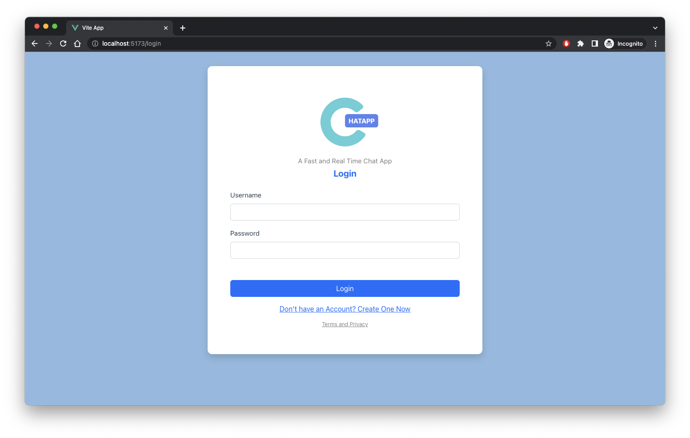
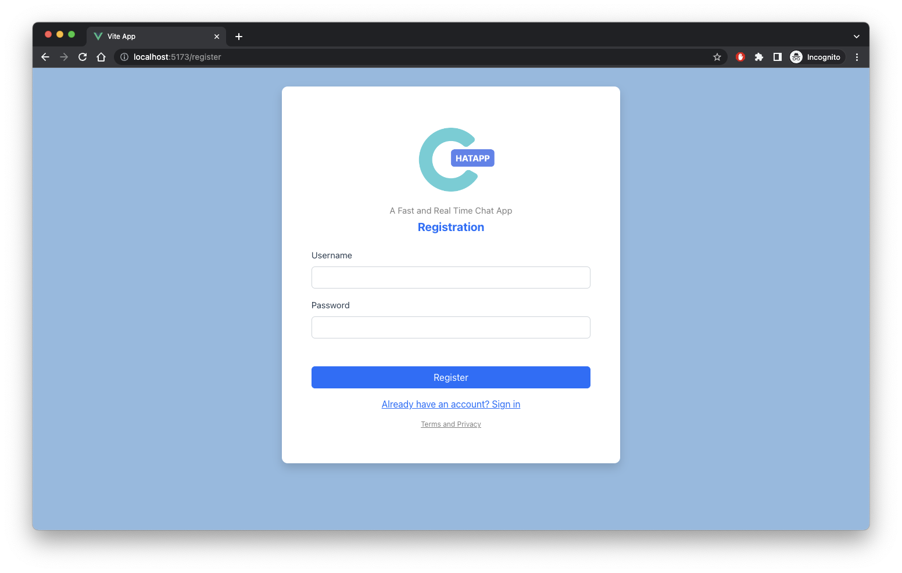
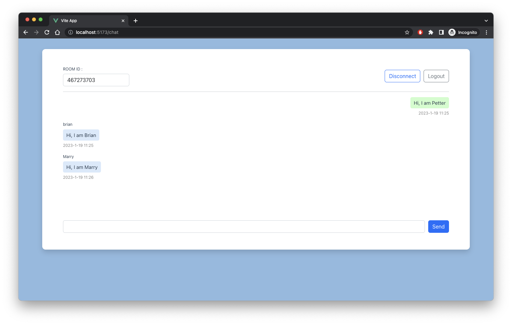

# A Web Socket Chat Application - Backend

After running the backend code, please go to https://github.com/Briantam0422/chatapp-frontend to run frontend code.

## Live Demo
A Demo website : http://chatapp.briantambusiness.com/login

## Backend

Run the project in the localhost

```jsx
cd cmd
cd main
go run main.go
```

## Database

tables

- users
    - id int
    - username varchar(255)
    - password varchar(255)
    - token varchar(500)
    - created_at timestamp
    - updated_at timestamp
    - deleted_at timestamp
- chat_records
  - id int
  - message TEXT
  - created_by varchar(255)
  - created_at timestamp
  - updated_at timestamp
  - deleted_at timestamp
- chat_rooms
  - id int
  - name varchar(255)
  - created_by varchar(255)
  - created_at timestamp
  - updated_at timestamp
  - deleted_at timestamp
- schema_migrations
  - version bigint
  - dirty tinyint(1)

### APIs

- Login
- Register
    - Create a new user
- isAuth
    - Check user is authorised
- chat/new
    - For create a new room
- chat/close
    - Close the web socket connection
- chat/initial
    - Initial a chat
- chat/start
    - Creat a web socket connect with server

### Middlewares

- CORS
- Authentication
    - Check token
    - Check use authentication
    - Auto login

## Login



## Registration



## Chat Room and Real Time Chat



# ** Instruction **
1. Register an account
2. Login to the account
3. Create a chat room (For room owner)
4. Share room id to your friends / Or open another browsers ( Pretend there are multiple people )
    1. Copy the room id and send to your friends
    2. Paste the room id in the "room_id" input box
    3. Click "Connect" button
5. Join room by id
    1. Paste room id in the “ROOM ID” input
    2. Click connect
    3. Now you can start sending messages with other people in the same room
6. Live chat
    1. real time message
7. Multiple user in a room
    1. A chat room supports multiple user in a room